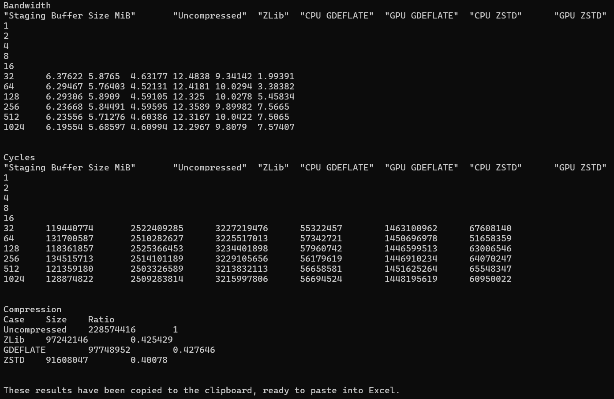
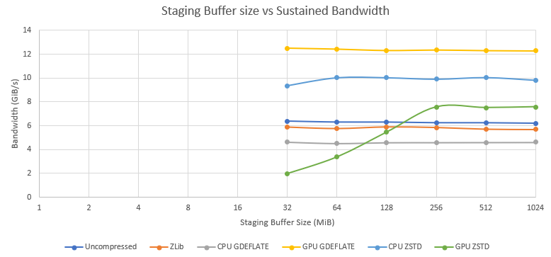
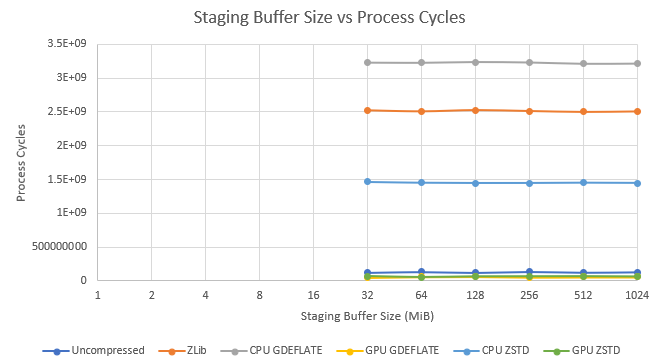

# GpuDecompressionBenchmark
This sample provides a quick way to see the DirectStorage runtime decompression performance by reading the contents of a file, compressing it and then decompressing multiple ways while measuring the bandwidth and CPU usage.  Decompression is performed using the GPU as well as the CPU for comparison.



## Features

- **Single file or directory input** — pass a directory to bundle all files into a single chunked archive, or pass a single file.
- **Configurable chunk size** — defaults to 256 KiB; adjustable via `-chunksize`.
- **Sustained throughput mode** — keeps the DirectStorage queue continuously fed for a specified duration to measure sustained performance (`-sustained`).
- **Validation mode** — compares decompressed output against the original uncompressed data to verify correctness (`-validate`).
- **Archive caching** — compressed archives and metadata are cached on disk and reused when the archives and chunk size are unchanged.
- **Clipboard export** — results are automatically copied to the clipboard in a tab-separated format, ready to paste into the included [Excel workbook](Visualization.xlsx) for visualization.

## Benchmark Results
By default, the benchmark submits batches with idle gaps between iterations and averages the results. Use `-sustained` to measure sustained throughput with the DirectStorage queue kept continuously fed. This better reflects real-world loading scenarios where many requests are in flight.

The benchmark results will be copied to the clipboard, and ready to paste into this [Excel document](Visualization.xlsx) which will render graphs like the following.






# Build
Install [Visual Studio](http://www.visualstudio.com/downloads) or higher.

Open the following Visual Studio solution and build
```
Samples\GpuDecompressionBenchmark\GpuDecompressionBenchmark.sln
```

# Usage
```
GpuDecompressionBenchmark <path> [-chunksize:<KiB>] [-sustained:<seconds>] [-validate]
```
## Arguments

| Argument | Description |
|---|---|
| `<path>` | Required. Path to a single file or a directory. When a directory is specified, all files within it are collected into a single chunked archive. |
| `-chunksize:<KiB>` | Optional. Uncompressed chunk size in KiB. Default is `256`. |
| `-sustained:<seconds>` | Optional. Measure sustained throughput for the given number of seconds with the DirectStorage queue kept continuously fed. |
| `-validate` | Optional. Compare decompressed output against the original uncompressed input on the first run to verify correctness. |

## Examples
Benchmark a single file with default settings:
```
Samples\GpuDecompressionBenchmark\x64\Debug\GpuDecompressionBenchmark.exe SomeDataFile.ext
```
Benchmark a directory of assets with 512 KiB chunks:
```
Samples\GpuDecompressionBenchmark\x64\Debug\GpuDecompressionBenchmark.exe C:\GameAssets -chunksize:512
```
Run a 10-second sustained throughput test with validation:
```
Samples\GpuDecompressionBenchmark\x64\Debug\GpuDecompressionBenchmark.exe C:\GameAssets -sustained:10 -validate
```

## Related links
* https://aka.ms/directstorage
* [DirectX Landing Page](https://devblogs.microsoft.com/directx/landing-page/)
* [Discord server](http://discord.gg/directx)
* [PIX on Windows](https://devblogs.microsoft.com/pix/documentation/)

